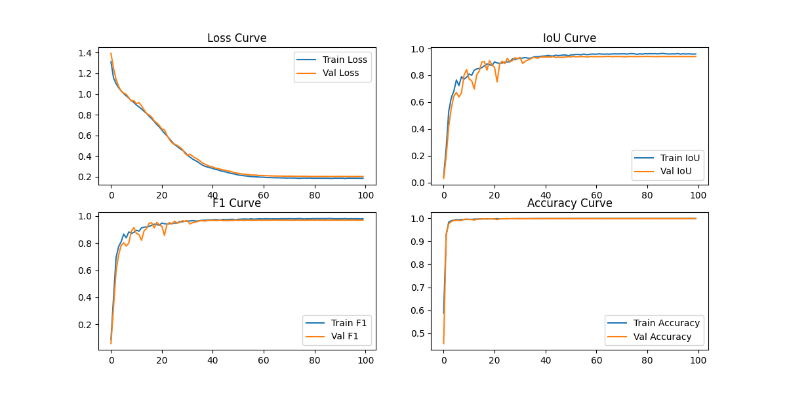

# optic-disc-segmentation-using-segmentation_models_pytorch 🚀
[](https://opensource.org/licenses/Apache-2.0)
[](https://python.org)

**One-line Tagline**：This is the repository for retinal iamges optic disc segmentation using segmentation_models_pytorch baesd on IDRID dataset

## Introduction
- ​**Problem Statement**​
  Providing a repository for retinal iamges optic disc segmentation using segmentation_models_pytorch.
  
- ​**Key Features**​  
  ✅ function 1：free to choose backbone and encoder
  
  ✅ function 2：visualize metrics's history
  
  ✅ function 3：inference on single image

- ​**Technology Stack**​
  
  

## Getting Started
### Training
Edit the config.py and run the od-seg.py.

### Inference on single image
run the od-seg-infer.py.

## Results
visualize the metrics during trainging

visualize the inference results, including mask image and overlay image


### Prerequisites
```bash
Python 3.9+  
pip install albumentations segmentation_models_pytorch tqdm scikit-learn scikit-image
